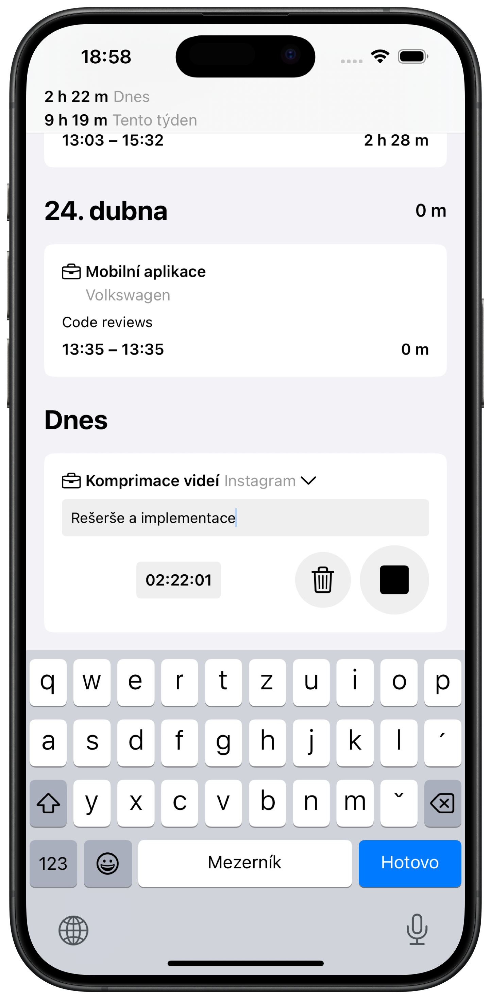
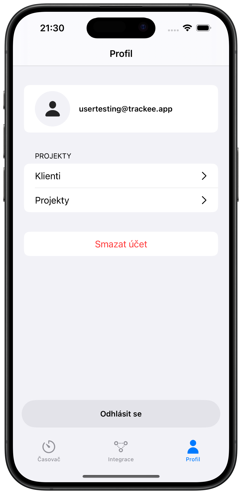
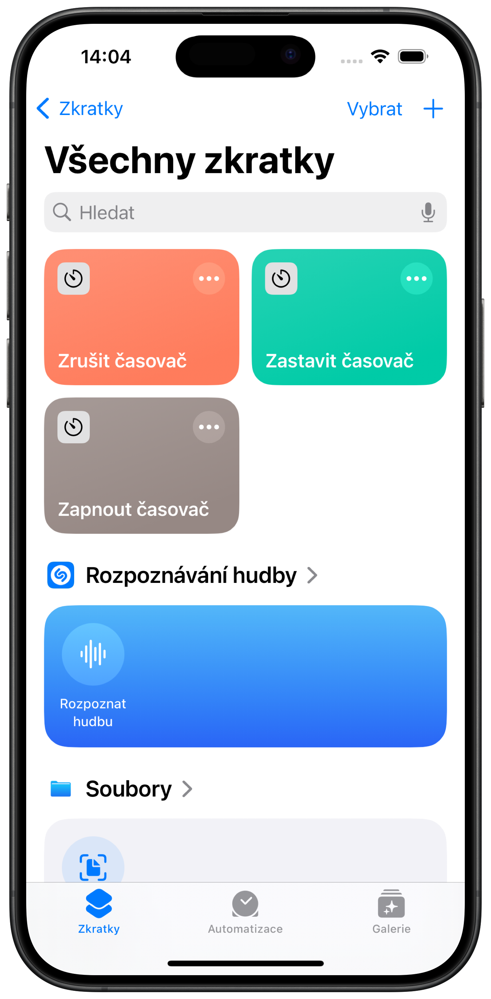

# Trackee App

This project manages frontend & backend applications for the Trackee time tracking & integration app.

Trackee allows creating and managing users, clients and projects, supports tracking and managing work time and supports several integration options. Whether you need to track your work time for financial purposes or strictly analytical purposes, Trackee will give you plenty of options to simplify your workflows.

> [!NOTE]
> This project contains projects for a Kotlin Multiplatform shared library, an iOS app and a ktor server.

> [!NOTE]
> The backend app is currently deployed on [Railway](https://railway.app) on [https://trackee-app-production.up.railway.app](https://trackee-app-production.up.railway.app)

- Frontend apps template: https://github.com/MateeDevs/devstack-native-app
- Backend app template: https://start.ktor.io

### Basic time tracking

  

The app supports basic features needed for tracking and managing timer entries. Timer entries belong to a specific project, which belongs to a specific client. Timer entries can also contain a description.

### User, client and project management

  

The user of the app can manage their clients and projects, which can be later edited or deleted.

### Integration

  

The app also allows basic integration. Timer control can be controlled via the [Shortcuts app](https://support.apple.com/guide/shortcuts/welcome/ios) and timer entries can be exported to CSV. The user can also create integrations for auto-exporting entries to [Clockify](https://clockify.me).

# Installation

The iOS app is available via public testing on the following link: https://testflight.apple.com/join/cTRdRkBc

> [!CAUTION]
> Firebase credentials are needed for a sucessful build & deployment of the backend app.

> [!IMPORTANT]
> The Testflight iOS app is connected to the [Railway backend app](https://trackee-app-production.up.railway.app). The backend app and the Firestore database are deployed in Oregon, USA. If you're furhter away from that location and you run the backend server locally, you may encounter longer request times due to a long distance between the backend server and the database server.

- In order to build and run the backend application locally, you can run `./gradlew backend:run`
- In order to build and run the iOS appliaction locally, navigate to the `ios` directory via `cd ios`, run the setup script via `scripts/setup.sh` and then you should be able to build the project via Xcode. Updates to signing & certificates setting may be needed.
- To make the client app connect to a custom backend URL, update the `NetworkClient.kt` file in the KMP shared module, comment out the lines specifying the Railway server URL and uncomment the lines specifying the local/custom URL. Rebuild the shared module (e.g. via `scripts/build-kmp.sh` in the `ios` directory) and re-build the iOS app to reflect the KMP module change.

# Architecture

Clean (common modules) + MVVM (platform-specific modules) architecture is used for its testability and ease of _modularization_. Code is divided into several layers:

- infrastracture (`Source`/`Provider`)
- data (`Repository`)
- domain (`UseCase`)

## Backend

The backend modules manages a [Ktor](https://ktor.io) server which handles all communication with the client. Backend uses [Cloud Firestore](https://firebase.google.com/products/firestore) for data storage.

## Shared

Shared module handles networking, persistence and contains UseCases which bridge platform specific code with common code. Module structure is organized with Clean architecture in mind to several layers of abstraction where everything is marked as internal to prevent confusion between domain and data layer.

> [!NOTE]
> The whole project relies heavily on dependency injection

## iOS
- more info in the [iOS readme](ios/README.md)
